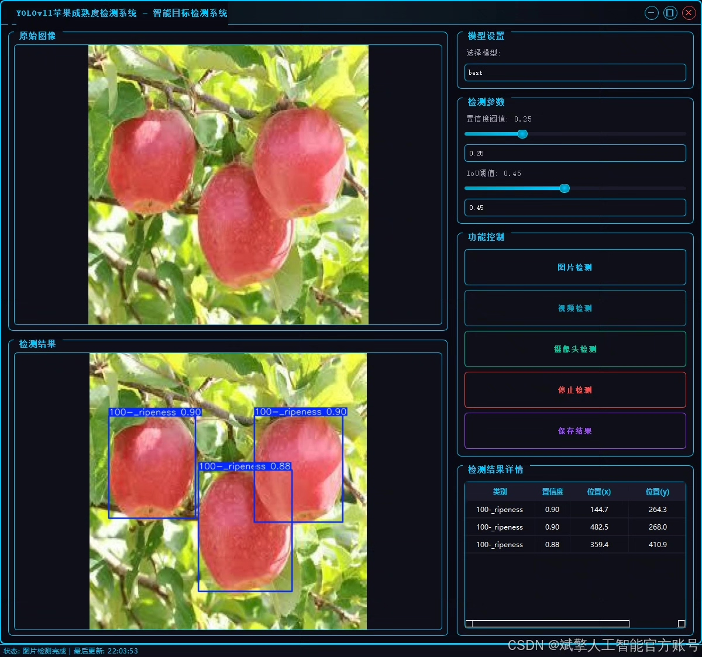
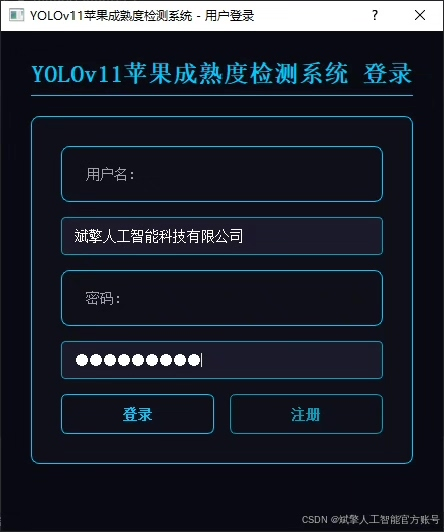
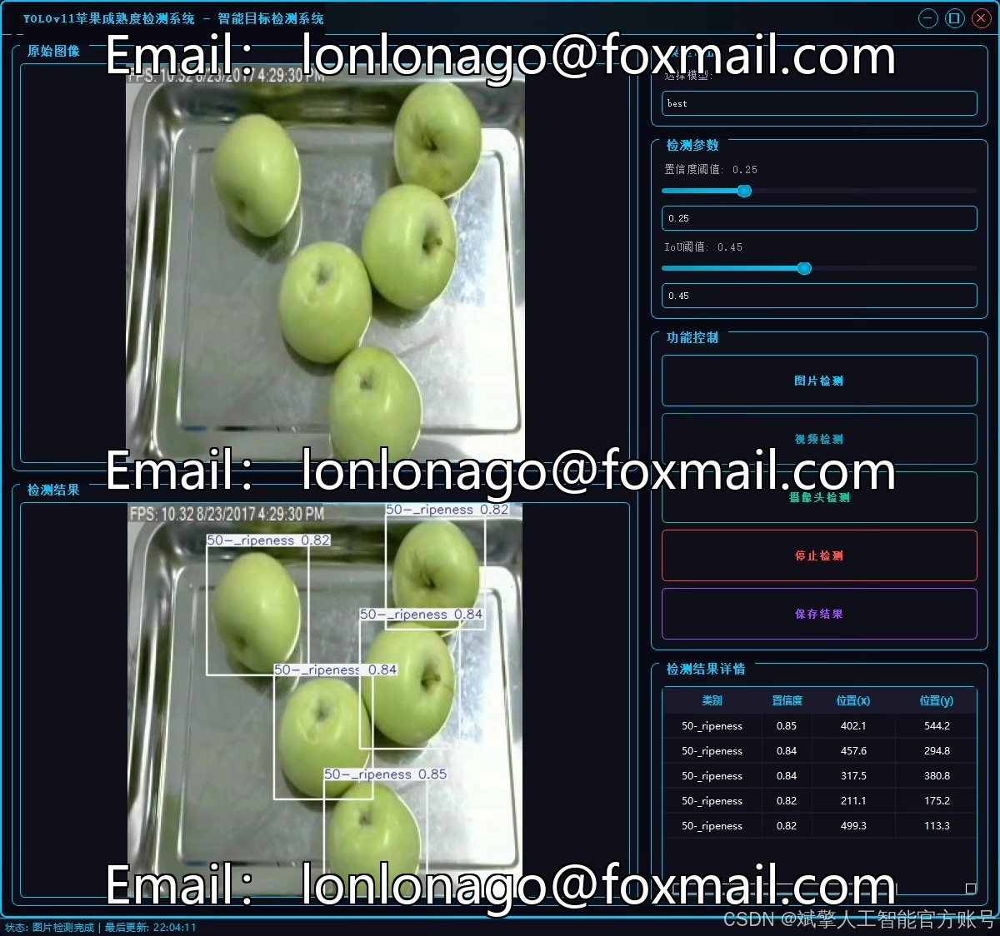
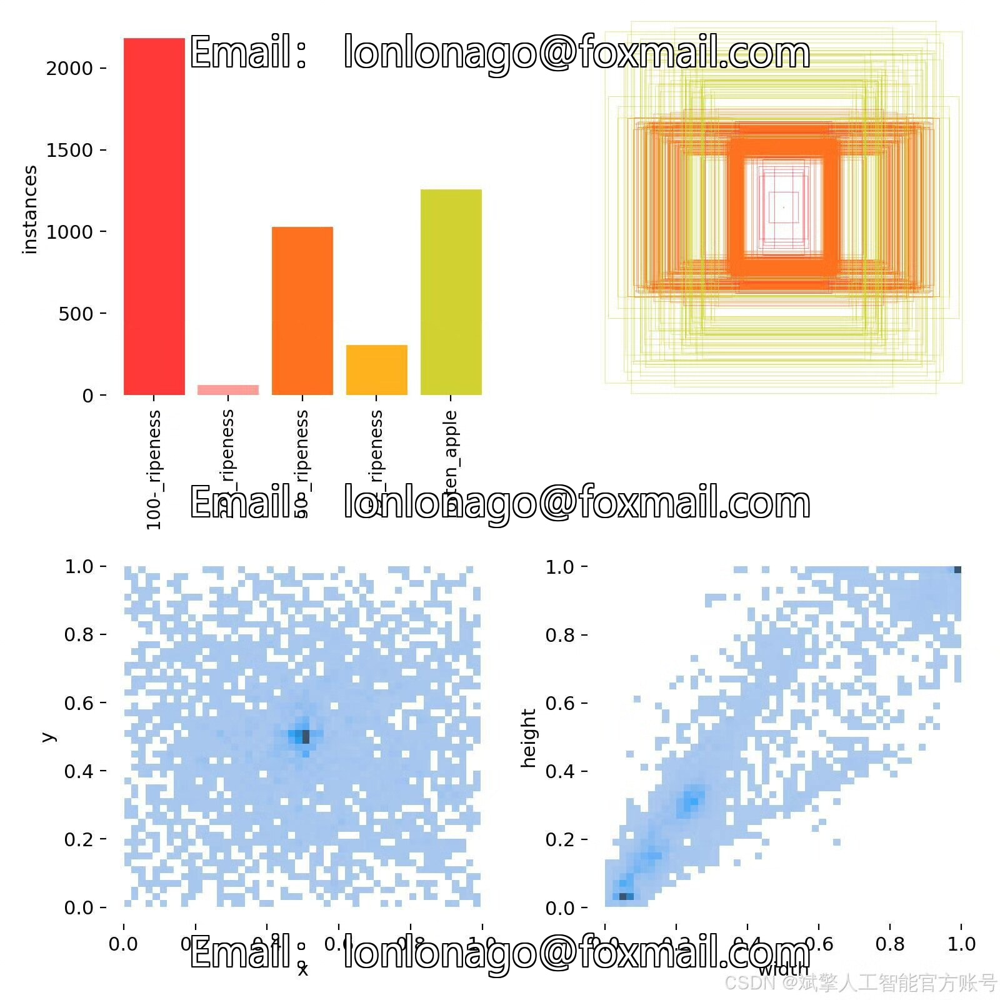
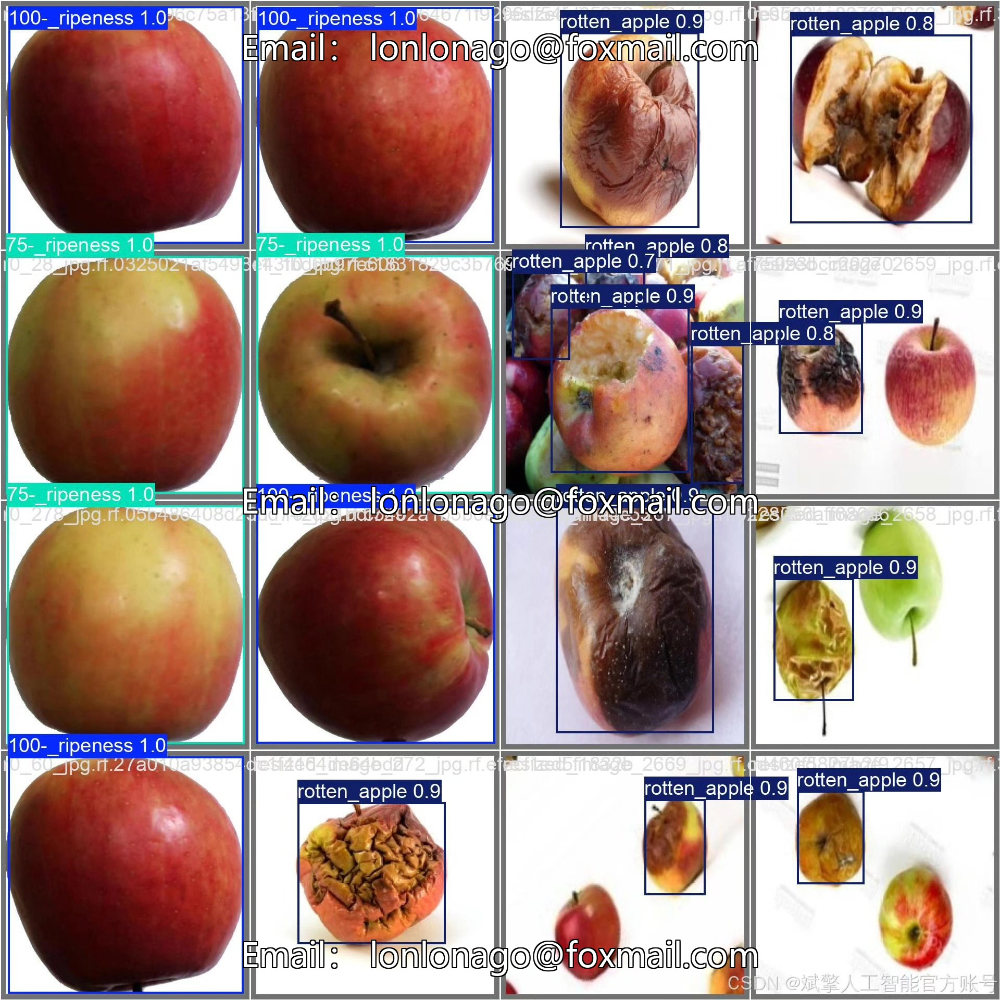

# YOLOv11 Apple Maturity Recognition Software Resources

## Body

YOLOv11 Apple Maturity Recognition Software Resources Share - Deep Learning YOLOv11-based Apple Maturity Recognition Detection System (YOLOv11+YOLO dataset + UI interface + login registration interface + Python project source code + model)

This article is based on the YOLOv11 deep learning framework, and a set of apple maturity recognition detection systems has been developed. It can efficiently and accurately recognize the maturity grades of apples (20% ripeness, 50% ripeness, 75% ripeness, 100% ripeness) and rotten states. The YOLO format dataset used in the system includes a training set (2144 images), a validation set (359 images), and a test set (225 images), totaling five categories of targets ('20-_ripeness', '50-_ripeness', '75-_ripeness', '100-_ripeness', 'rotten_apple'). Through optimization of the model structure and training strategies, YOLOv11 achieved high precision detection (mAP@0.5 up to 94.1%) on the test set. In addition, the system integrates a user-friendly UI interface, supporting login registration functions, facilitating real-time monitoring of apple maturity status by agricultural workers, and providing intelligent solutions for orchard management and harvest decision-making.

Dataset:
nc: 5
names: ['100-_ripeness', '20-_ripeness', '50-_ripeness', '75-_ripeness', 'rotten_apple'],
dataset quantity: training set 2144 images, validation set 359 images, test set 225 images

✅ User login registration: Supports password verification and security validation.
✅ Three detection modes: Based on the YOLOv11 model, supports image, video, and real-time camera detection, with precise recognition of targets.
✅ Dual-screen comparison: Display original images and detection results on the same screen.
✅ Data visualization: Real-time table display of detected target categories, confidence levels, and coordinates.
✅ Intelligent parameter adjustment: Offers a confidence slide bar, dynamically optimizing detection accuracy to meet different scene requirements.
✅ Sci-fi style interactive interface: Dark theme combined with dynamic light effects, reducing visual fatigue and improving operational experience.

## Images

## Payment

Here is a pay link on Stripe ( https://buy.stripe.com/3cs8yP7sY87d0vu9AB ). Please contact me lonlonago@foxmail.com after funding $89, and I will send you a complete data files , thank you!

